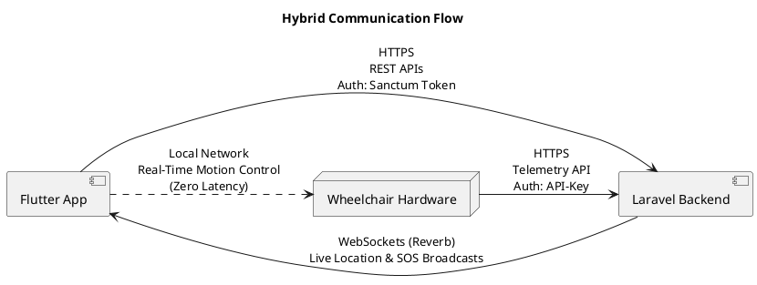
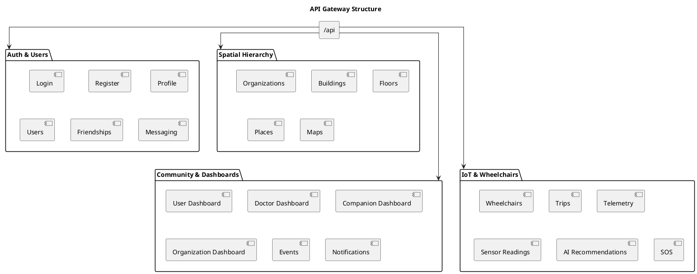
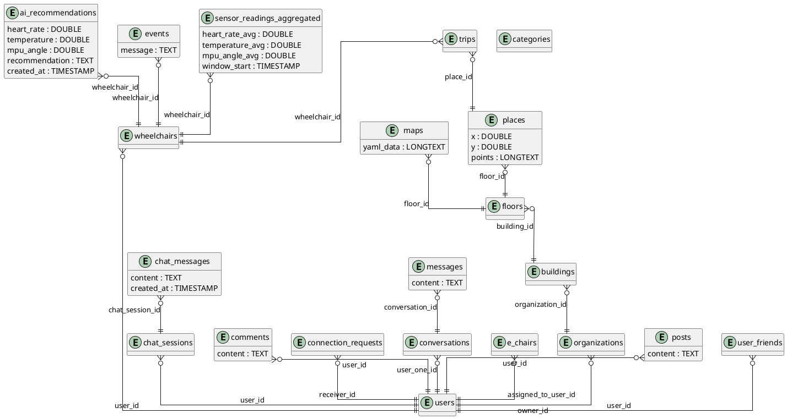

# Chairpal Backend Implementation Documentation

## 1. Overview (updated)

### 1.1 Objectives
The Chairpal backend serves as the centralized system orchestrating communication between the Flutter mobile application, IoT wheelchair hardware, and the MySQL database. Its primary objectives are:
- **API Provisioning**: A comprehensive suite of RESTful APIs for secure, seamless data flow.
- **Hierarchical Spatial Management**: Managing the indoor navigation hierarchy (Organization → Building → Floor → Place).
- **Indoor Maps & Semantic Data (added)**: Storing spatial (X, Y) coordinates and accessibility metadata for indoor points of interest.
- **Mapping & Autonomous Trips**: Handling maps generated by the wheelchair (LIDAR) and securely calculating/storing valid paths for autonomous navigation.
- **IoT Telemetry Integration**: Serving as the cloud endpoint for continuous wheelchair sensor streaming (movement, obstacles, health) every 30 seconds.
- **Real-Time Event Processing**: Broadcasting critical events (live location, fall detection, SOS) to connected clients via WebSockets and Chat.
- **Community & Support**: Providing a social community for patients and an AI Chatbot for quick assistance and simple app guidance.

### 1.2 Responsibilities
- **Business Logic**: Enforcing trip lifecycles (start, end, fail), connection limits between patients, companions, and doctors, and sensor data aggregation to prevent DB bloat.
- **Data Management & Cleanup**: Maintaining referential integrity via Eloquent ORM. Periodically deleting old data to maintain performance, while using Queues to handle high traffic without crashing.
- **Authentication & Authorization**: Dual-layered security separating human user authentication from IoT machine-to-machine authentication.

---

## 2. System Architecture & Communication Flow (updated)

### 2.1 Components
1. **Flutter Mobile Application**: Client interface tailored for users (Patients), Companions, Doctors, and Organization Admins. Handles login, password changes, and UI interactions.
2. **Laravel Backend API**: Core cloud infrastructure hosting business logic, spatial mapping, and user data.
3. **MySQL Database**: Relational database managing persistent state.
4. **Wheelchair Hardware (IoT)**: Physical wheelchair running ROS/Python, streaming sensor data to the backend.

### 2.2 Architectural Style (added)
The backend follows **Service-Oriented Architecture (SOA)** with decoupled, modular services. It adheres to **RESTful API** design principles (standard HTTP verbs and status codes) and incorporates **Event-Driven Architecture (EDA)** for real-time functionality — critical events such as a fall trigger asynchronous listeners instantly.

### 2.3 Hybrid Communication Flow



**Flow Diagram Detailed Explanation:**
- **Flutter App ↔ Backend**: Standard HTTPS REST requests are used for dashboards, profiles, community features, and managing connections. Authentication uses Laravel Sanctum tokens.
- **Wheelchair ↔ Backend**: The wheelchair hardware uses a dedicated HTTPS telemetry channel authenticated via a secure API-Key. It continuously pushes status updates, sensor readings, trip endings/failures, and created maps (via LIDAR) to the cloud.
- **Flutter ↔ Wheelchair (LAN)**: To guarantee user safety and eliminate cloud latency, manual motion control commands (e.g., joystick movements or UI buttons) are sent directly from the Flutter app to the wheelchair over the local network. The backend acts strictly as a telemetry observer, not a control relay.
- **Backend → Flutter (WebSockets)**: The backend processes incoming telemetry and uses Laravel Reverb (WebSockets) to push live GPS/indoor coordinates and instant SOS alerts back to connected clients (like Companions) in real time.

---

## 3. Technology Stack (added)

| Component | Technology | Rationale |
| :--- | :--- | :--- |
| **Backend Framework** | Laravel | Expressive syntax, robust security, built-in Eloquent ORM, WebSocket support. |
| **Language** | PHP 8+ | Strong typing, enums, match expressions. |
| **Database** | MySQL | ACID compliance for complex spatial and user relationships. |
| **Real-Time** | Laravel Reverb | Server-push for live GPS/indoor coordinates and SOS WebSockets. |
| **ORM** | Eloquent | Abstracts complex SQL; manages relationships efficiently. |
| **File Storage** | Laravel Local Storage | Manages avatars, place images, and floor map JSON/images. |

---

## 4. API Gateway Structure (updated)



**Structure Diagram Detailed Explanation:**
The backend is logically divided into four main domains under the `/api` gateway:
- **Auth & Users Domain**: Manages authentication, profiles, connection requests, internal chat, and the AI Chatbot.
- **Spatial Hierarchy Domain**: Handles CRUD operations for Organizations, Buildings, Floors, Places, and mapping approvals. Used by users for private places and by Organization Admins for public ones.
- **Community & Dashboards Domain**: Aggregates data for role-specific dashboard statistics. Processes notifications, community posts (likes/comments), and SOS alerts.
- **IoT & Wheelchairs Domain**: Core telemetry engine. Handles wheelchair provisioning, trip lifecycles (autonomous/manual), high-frequency sensor readings, and emergency SOS triggering.

---

## 5. Authentication, Roles & Policies (updated)

### 5.1 Dual Authentication Model
1. **Human Users (Flutter)**: Authenticate via email or username. The backend issues a **Laravel Sanctum Bearer Token** for all subsequent requests.
2. **Wheelchair (IoT)**: Authenticates via a 32-character **API Key** bound to the wheelchair's serial number. The Flutter app passes this key locally to the wheelchair, which attaches it to a custom `api-key` header on all telemetry requests.

### 5.2 Custom Middleware: VerifyWheelchairApiKey (added)
IoT endpoints are secured via dedicated middleware that validates the API key and attaches the resolved wheelchair object to the request, eliminating redundant database queries in controllers.
```php
public function handle(Request $request, Closure $next): Response
{
    $apiKey = $request->header('api-key');
    if (!$apiKey) {
        return response()->json(['message' => 'Missing api-key header.'], 401);
    }
    
    $wheelchair = Wheelchair::where('api_key', $apiKey)->first();
    if (!$wheelchair) {
        return response()->json(['message' => 'Invalid api-key.'], 401);
    }
    
    // Attach wheelchair to request so we can access it in controller without re-querying
    $request->merge(['authenticated_wheelchair' => $wheelchair]);
    return $next($request);
}
```

### 5.3 Payload Optimization for IoT (added)
The `wheelchair_id` is omitted entirely from request bodies sent by the hardware. The `VerifyWheelchairApiKey` middleware resolves the device from the header alone, reducing bandwidth and processing overhead on constrained IoT hardware.

### 5.4 Roles & Permissions
- **Patient (User)**: Can create private organizations, buildings, and floors. For public organizations, they cannot add floors or maps, but can add specific places to visit. They control the wheelchair manually and autonomously.
- **Companion**: Connects to a Patient. Sees everything regarding the Patient's status but **cannot** control the wheelchair movement. Follows exactly 1 Patient (Patient can have multiple companions).
- **Doctor**: Follows multiple patients. Access is restricted to health dashboards, sensor statistics, and AI recommendations.
- **Organization Admin**: Has exclusive rights to manage spatial hierarchy (Buildings, Floors, Places, and Maps) within their assigned Organization.

### 5.5 Authorization Policies (added)
Laravel Policies enforce granular resource security. For example, `PlacePolicy` ensures only the Organization Admin who owns a building can edit or delete places within it, preventing cross-tenant data access.

### 5.6 Connection Management
- Patients and Doctors/Companions connect via direct connection requests.
- Once accepted, they become friends in the community and a private chat is established.
- The Patient holds ultimate control and can delete the connection with any Companion or Doctor at any time.

---

## 6. Dashboards & Real-Time Monitoring (updated)

### 6.1 Role-Based Dashboards
1. **Patient Dashboard**: Displays current vitals (heart rate, temperature, MPU tilt angle indicating faints/falls), graphical trends, active trips, last visited places, and recent AI alerts.
2. **Doctor Dashboard**: Statistical overview of all supervised patients, categorized by risk level (Normal/Medium/Critical).
3. **Companion Dashboard**: Returns the assigned patient's data, mimicking the patient's view and activates Live Tracking via Reverb WebSockets showing the patient moving on the indoor map in real time.
4. **Organization Admin Dashboard**: Overview of added buildings, places, floors, maps, and real-time activities within their organization.

**Sample Patient Dashboard Response (added):**
```json
{
  "message": "User dashboard data retrieved.",
  "data": {
    "current_vitals": {
      "heart": { "value": 85, "status": "normal" },
      "obstacle": { "movement": "movement", "mpu_angle": 1.5, "status": "normal" }
    },
    "ai_recommendation": {
      "risk_level": "medium",
      "recommendation": "Maintain steady pace. Slight incline detected."
    },
    "last_visited_places": [
      { "id": 4, "name": "Radiology Lab" }
    ]
  }
}
```

### 6.2 Sensor Readings & Data Aggregation
Sensors push data to the backend every 30 seconds. To prevent database overload, the system uses a Queue mechanism for incoming requests and applies **Data Aggregation**, summarizing high-frequency data into average/min/max windows.

### 6.3 Emergency SOS Protocol
When a critical anomaly (like a fall/tilt) is detected manually or by AI:
1. A high-priority SOS alert (database notification & WebSocket) is dispatched to Companions.
2. An automatic emergency message containing the live location is injected into the Community Chat.
3. Live Location tracking is activated, sending coordinates to two separate endpoints (internal map coordinates vs external GPS) every 30 seconds.

**Sample SOS Chat Injection (added):**
```json
{
  "sender": "System_Emergency",
  "message": "🚨 AUTOMATIC SOS: Patient has experienced a critical fall!",
  "payload": {
    "latitude": 30.0444,
    "longitude": 31.2357,
    "status": "CRITICAL",
    "live_location_active": true
  },
  "timestamp": "2026-06-11T13:40:00Z"
}
```

### 6.4 Event Deduplication (added)
To prevent database flooding from sensors stuck in error states (e.g., the same obstacle detected 50 times per second), an `Event::findDuplicate()` function updates the timestamp of an existing event rather than inserting duplicate rows.

---

## 7. Mapping, Navigation & Trips (updated)

### 7.1 Indoor Navigation Support (added)
- **Map Delivery**: Secure endpoints serve high-resolution floor map images used by both Flutter and the wheelchair hardware as navigational grids.
- **Semantic Spatial Queries**: The API supports querying places by category or proximity, generating dynamic destination lists.
- **Location Context**: The backend aligns the user's current Floor with the wheelchair's relative (X, Y) coordinates to calculate distances to nearby Places.

### 7.2 Mapping Process (LIDAR)
1. **Initiation**: The Flutter app forces the user to select a location if an autonomous trip is desired. If no map exists, the user or admin requests permission to create a map for a specific floor.
2. **Validation**: The backend validates permissions (Admin for public, User for private) and returns approval.
3. **Execution**: A "Start Mapping" button appears. The wheelchair generates the map via LIDAR. Places can be added during or after this.
4. **Completion**: The map is sent directly from the wheelchair to the backend. The wheelchair only stores what is sent back to it to conserve memory.

### 7.3 Trips (Manual vs Autonomous)
- **Manual Trip**: User controls via Joystick or UI. Does not strictly require a predefined path.
- **Autonomous Trip**: Requires a saved map. User selects a Place. If the Place lacks a center point, the backend calculates it. The Place ID is sent to the wheelchair, which validates the path and begins movement, updating the backend continuously until success or failure.

---

## 8. Database Design (ERD) & Data Integrity (updated)

The database adheres to 3rd Normal Form (3NF) and is optimized for high-frequency IoT data and strict medical relationships.

### 8.1 Sensor Pruning (Cron Job) (added)
To maintain data integrity and prevent database bloat, a scheduled Laravel Cron Job automatically deletes aggregated sensor records older than 30 days nightly at 02:00.
```php
// In app/Console/Kernel.php
protected function schedule(Schedule $schedule)
{
    // Delete sensor reading data older than 30 days every night to maintain Data Integrity
    $schedule->call(function () {
        \DB::table('sensor_readings_aggregated')
            ->where('window_start', '<', now()->subDays(30))
            ->delete();
    })->dailyAt('02:00');
}
```

### 8.2 ERD Model


---

## 9. API Design & Best Practices (added)

### 9.1 Standardized Responses
A custom `ApiController` enforces a uniform JSON contract across all endpoints, guaranteeing consistent `success`, `message`, and `data`/`errors` fields.
```php
// Inside ApiController.php
protected function successResponse($message, $code = 200, $parameters = [])
{
    return response()->json(array_merge([
        'success' => true,
        'message' => $message,
    ], $parameters), $code);
}

protected function errorResponse($message, $code = 400)
{
    return response()->json([
        'success' => false,
        'message' => $message,
    ], $code);
}
```

### 9.2 API Resources & Dynamic Includes
Raw database output passes through a transformation layer to strip sensitive fields (e.g., passwords), format dates, and compute dynamic attributes (e.g., `average_rating`, `visitors_count`) appended directly to the response to minimize client-side round trips.
```json
{
  "success": true,
  "message": "Place retrieved successfully!",
  "data": {
    "id": 1,
    "name": "Cardiology Department",
    "floor_id": 2,
    "average_rating": 4.5,
    "visitors_count": 120,
    "rating_distribution": {
      "1": "0%", "2": "0%", "3": "10%", "4": "30%", "5": "60%"
    }
  }
}
```

---

## 10. Performance & Architecture Optimizations (added)

### 10.1 Eager Loading (N+1 Prevention)
Eloquent's `with()` resolves related models in a single optimized SQL query, avoiding the N+1 problem on data-heavy views.
```php
$activeTrip = Trip::with(['place', 'wheelchair'])
    ->whereHas('wheelchair', function ($q) use ($targetUser) {
        $q->where('user_id', $targetUser->id);
    })->whereIn('status', ['started', 'in_progress'])->latest()->first();
```

### 10.2 Pagination
Large datasets (Community Posts, Friends Lists, Place Reviews) are paginated at 15 records per request (`->paginate(15)`), preventing memory overflow.

### 10.3 Error Handling & Audit Logging
- **Form Request Validation**: Malformed payloads are rejected immediately with a `422 Unprocessable Entity` response detailing failing fields.
- **Global Exception Handling**: Database failures are caught in try-catch blocks. Transactions are rolled back (`DB::rollBack()`) returning a clean `500 Internal Server Error`.
- **Audit Logging**: Critical actions (like Patient removing a Doctor) are permanently logged to an `AuditLog` table capturing action, user, IP, and timestamp.

### 10.4 File Management
Floor maps, user avatars, and place images are stored on Laravel's public storage disk (`storage/app/public/maps`). All upload endpoints enforce strict MIME type validation and a `2 MB` size limit (`image|mimes:jpeg,png,jpg,gif,svg|max:2048`) to prevent storage exhaustion.

---

## 11. REST API Endpoints Reference

### 11.1 Auth & Profile
| Method | Endpoint | Description |
| :--- | :--- | :--- |
| **POST** | `/api/signup` | Registers a new user. |
| **POST** | `/api/login` | Authenticates user, returns Sanctum token. |
| **POST** | `/api/refresh-token` | Refreshes the session token. |
| **POST** | `/api/verify-otp` | Verifies account OTP. |
| **POST** | `/api/forgot-password` | Initiates password reset process. |
| **POST** | `/api/reset-password` | Resets the user's password. |
| **POST** | `/api/logout` | Revokes the active token. |
| **GET** | `/api/profile` | Retrieves current user profile. |
| **PUT** | `/api/profile/update` | Updates profile details. |
| **PUT** | `/api/profile/change-password` | Changes the account password. |
| **DELETE** | `/api/profile` | Deletes the user account permanently. |

### 11.2 Dashboards & Tracking
| Method | Endpoint | Description |
| :--- | :--- | :--- |
| **GET** | `/api/dashboard/user` | Patient dashboard (Vitals, trips, alerts). |
| **GET** | `/api/dashboard/companion` | Companion dashboard (Patient tracking). |
| **GET** | `/api/dashboard/doctor` | Doctor dashboard (Patient statistics). |
| **GET** | `/api/dashboard/org-admin` | Organization Admin dashboard. |
| **POST** | `/api/location/user` | User pushes live location (every 30s). |
| **GET** | `/api/location/companion/user` | Companion fetches user live location. |
| **POST** | `/api/sos` | Triggers the emergency SOS protocol. |
| **POST** | `/api/sos/cancel` | Cancels an active SOS alert. |

### 11.3 Spatial Hierarchy
| Method | Endpoint | Description |
| :--- | :--- | :--- |
| **GET/POST** | `/api/organizations` | List or create an organization. |
| **GET/POST** | `/api/organizations/{org}/buildings` | List or create buildings in an org. |
| **GET/POST** | `/api/buildings/{bld}/floors` | List or create floors in a building. |
| **GET/POST** | `/api/floors/{flr}/places` | List or create places in a floor. |
| **GET/POST** | `/api/floors/{flr}/map` | Get or upload floor map (LIDAR mapping). |
| **GET** | `/api/places/last-visited` | Retrieves recently visited places. |

### 11.4 Community, Chat & Connections
| Method | Endpoint | Description |
| :--- | :--- | :--- |
| **GET/POST** | `/api/posts` | List or create community posts. |
| **POST** | `/api/posts/{post}/like` | Like or unlike a post. |
| **POST** | `/api/posts/{post}/comments` | Add a comment to a post. |
| **POST** | `/api/posts/{post}/hide` | Hide a post from the user's feed. |
| **POST** | `/api/connections/send` | Send a Doctor/Companion request. |
| **POST** | `/api/connections/{req}/handle` | Accept/Reject a connection request. |
| **DELETE** | `/api/connections/{user}/remove` | Remove an active connection. |
| **GET** | `/api/chats` | List user chat conversations. |
| **POST** | `/api/chats/{user}` | Start or send a message to a user. |

### 11.5 Chatbot (AI Assistant)
| Method | Endpoint | Description |
| :--- | :--- | :--- |
| **GET/POST** | `/api/chatbot/sessions` | List or start a new chatbot session. |
| **POST** | `/api/chatbot/sessions/{session}/chat` | Send message to AI and get guidance. |

### 11.6 IoT & Wheelchair Telemetry (API-Key Protected)
| Method | Endpoint | Description |
| :--- | :--- | :--- |
| **POST** | `/api/wheelchairs/connect` | App connects to wheelchair, generating API Key. |
| **GET** | `/api/wheelchairs/mapping-permission` | Checks if user/admin can map this floor. |
| **POST** | `/api/wheelchairs/{id}/trips` | App initiates a new trip (Manual/Autonomous). |
| **POST** | `/api/iot/trip/end` | Hardware signals successful trip completion. |
| **POST** | `/api/iot/trip/fail` | Hardware signals trip failure. |
| **POST** | `/api/iot/movement/update` | Hardware streams exact coordinates & status. |
| **POST** | `/api/iot/sensor-readings` | Hardware streams aggregated vitals/sensors. |
| **POST** | `/api/iot/floors/{floor}/map` | Hardware uploads generated map. |
