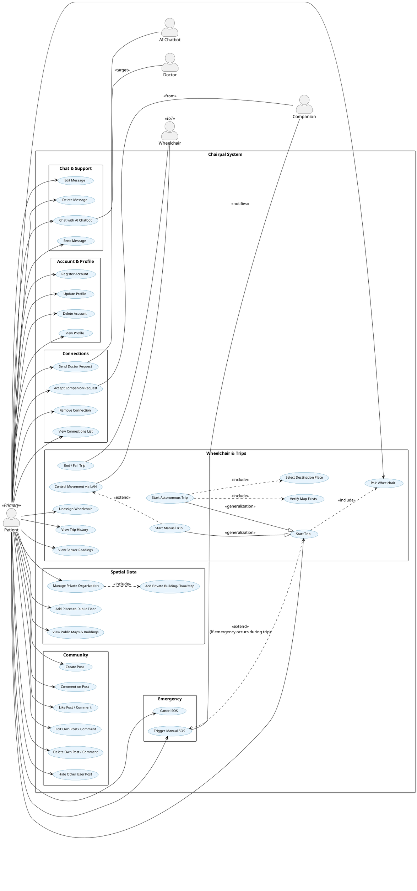
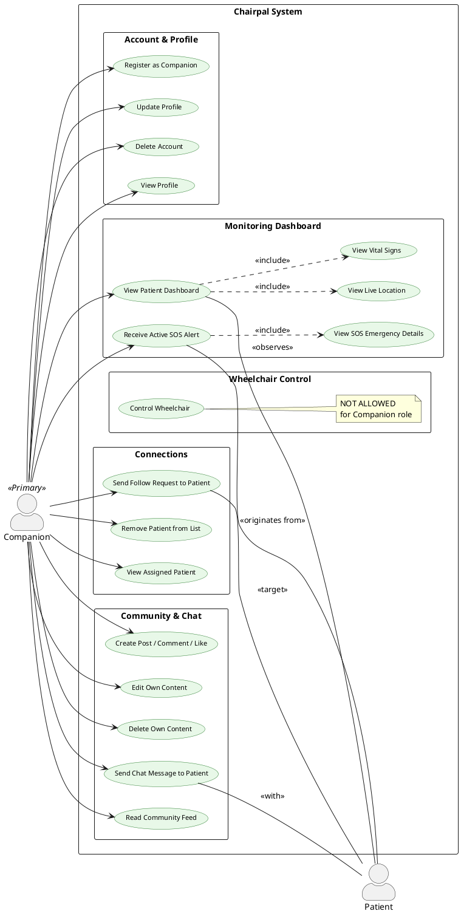
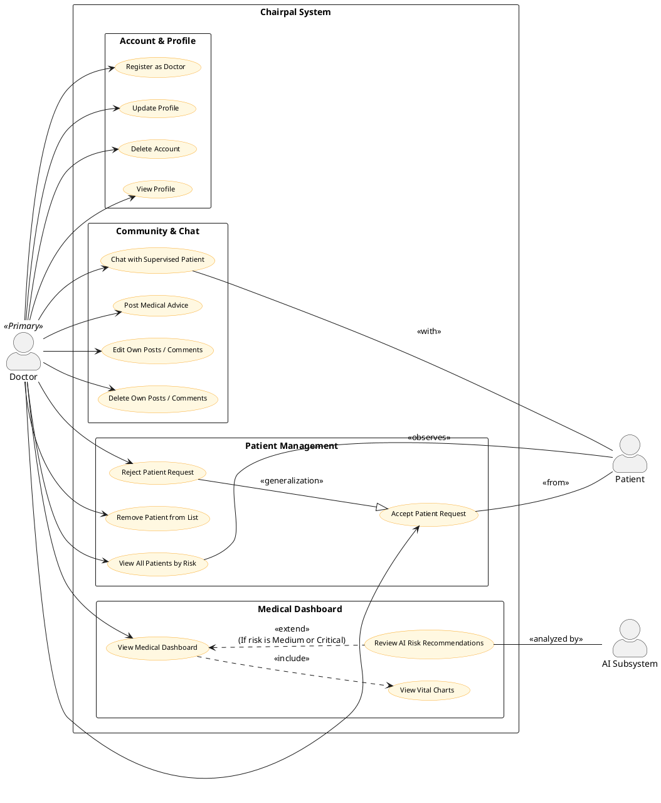
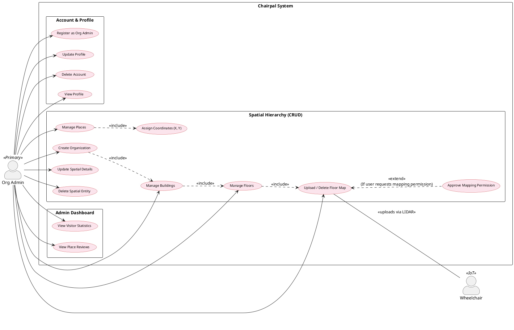
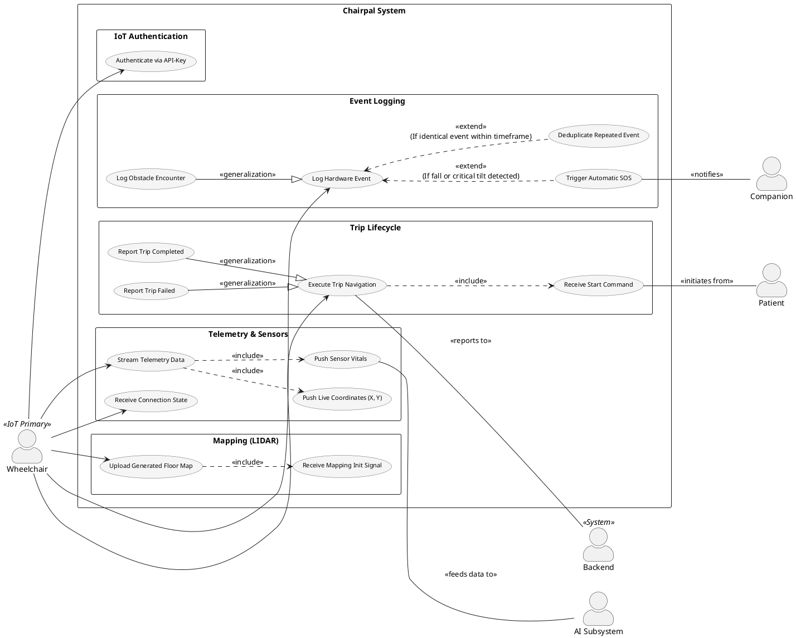
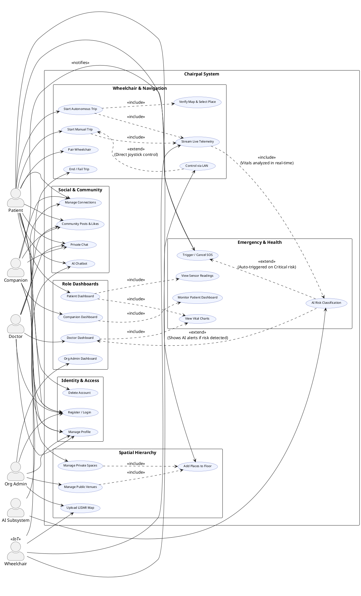

# Chairpal - PlantUML Use Case Diagrams

This document provides **6 PlantUML Use Case Diagrams** fully aligned with the [Chairpal-Use-Cases.md](file:///d:/apiCourse/API_Projects/Chairpal/Chairpal-Use-Cases.md) CRUD tables. Each diagram covers one actor with their connected secondary actors, followed by a Full System diagram. All diagrams use proper `<<include>>`, `<<extend>>`, and `<<generalization>>` relationships.

> **Conventions used:**
> - `<<include>>` = Mandatory sub-step (always happens).
> - `<<extend>>` = Conditional behavior (only under specific conditions).
> - `--|>` (Generalization) = A specialized version of another use case.

---

## 1. Patient (User) Use Case Diagram

---

## 2. Companion Use Case Diagram

---

## 3. Doctor Use Case Diagram

---

## 4. Organization Admin Use Case Diagram

---

## 5. IoT Wheelchair Use Case Diagram

---

## 6. Full System Unified Use Case Diagram

This diagram aggregates all actors and their core use cases into one cohesive view. To prevent clutter, use cases are grouped by domain modules with cross-module `<<include>>` and `<<extend>>` relationships clearly marked.

